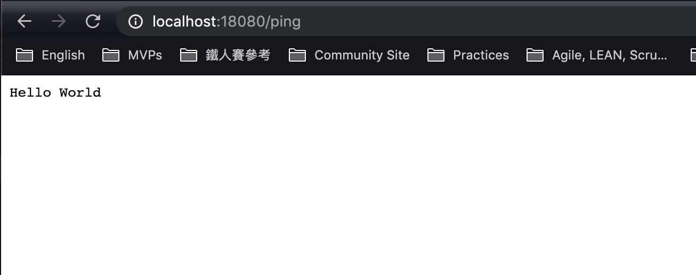

# Go Build POC for ubuntu

1. [download & install](https://golang.org/dl/) golang for local compile, or use `brew` to make easier:

        brew install go

2. build golang app:

        env GOOS=linux GOARCH=amd64 go build -v -o ./app/hello ./src/hello.go

3. execute `docker-compose up -d`
4. Open [http://localhost:18080/ping](http://localhost:18080/ping)

## Resource

- [ubuntu + golang image](https://hub.docker.com/r/dqneo/ubuntu-build-essential/)
- [Go (Golang) GOOS and GOARCH](https://gist.github.com/asukakenji/f15ba7e588ac42795f421b48b8aede63)
